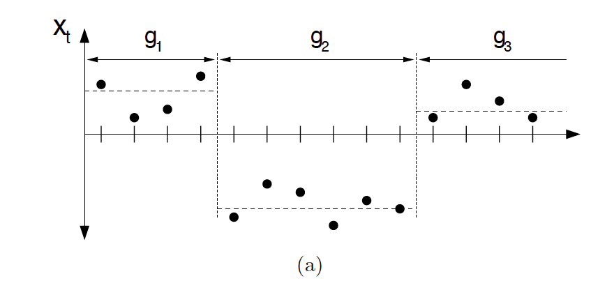
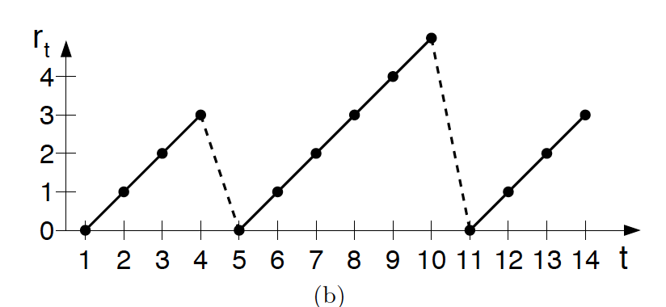
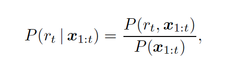
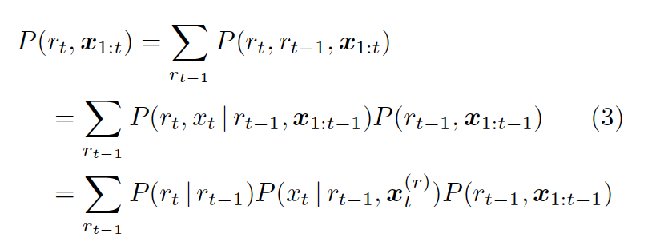
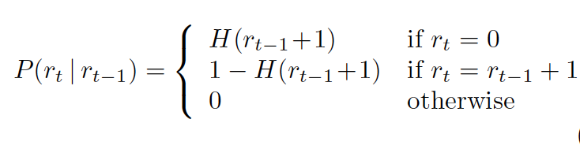
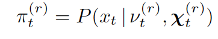
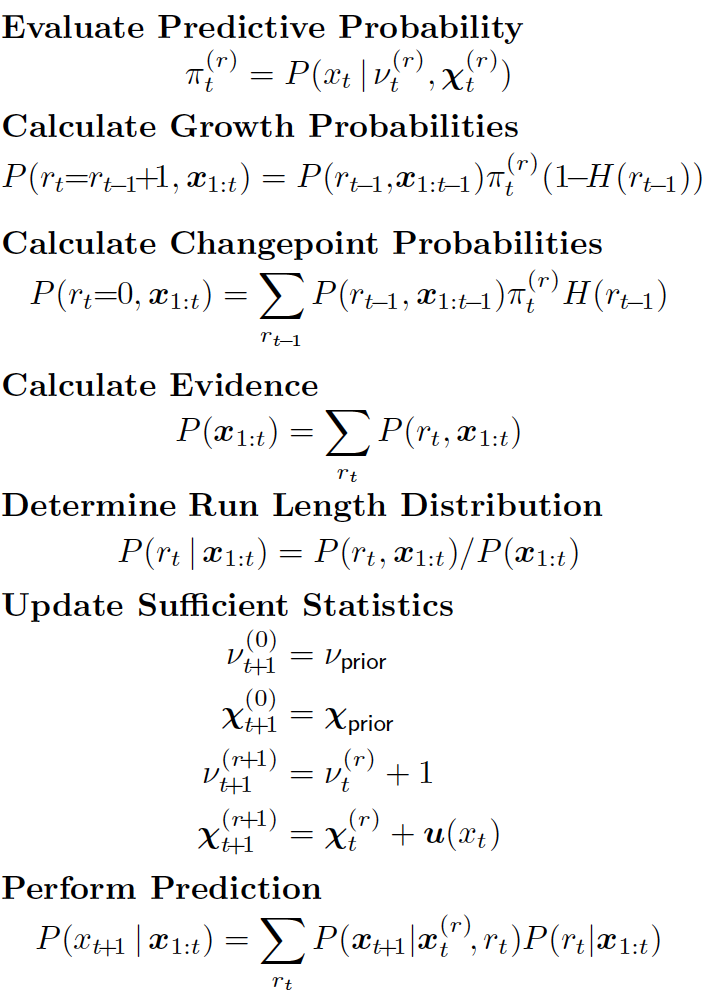

Documentation for the Disaggregation Algorithm
**********************************************

.. automodule:: disaggregation.bayesian_cp_detect

Changepoint Algorithm 
=====================

The first step of this algorithm is using BCP(Bayesian changepoint) to detect the changepoints of a given time series.

.. automodule:: disaggregation.bayesian_cp_detect.cp_detect
    :members: bayesian_change_point_4

Explanation of the ChangepointAlgorithm
=======================================

What this algorithm does is: given a time series, find the probability of a change point occured at each time point.

For example this is one segment of the given 1d time series

   A time series with change points

With naked eyes we can tell that there are two change points, at first the mean is around a positive number, and then changed into negative and then back to positive.

The change points can also translate to run lengths

   The run lengths of the above time series

This online change point algorithm is iteratively computing this conditional probability.

P(r\ :sub:`t`\| x\ :sub:`1:t`\)

which means that given all the up till now observations, the probablity of a changepoint occurs.

Using the definition of conditional probability:

Using bayesian formula, we can rewrite this nominator in the above formula into:

Examing each terms in the last line of the above formula. We are aiming at computing those three probabilies, the last one can be obatined iteratively. The first one can be obtained if we introduce the appropriate assumption on the distribution of changepoints. 

The change points occurance can be modeled by introducing the hazard function. In the default setting, we use constant for the hazard function, which means that the occurance of change points follows a poisson distribution with respect to run length.

The second term which is so called the predictive probability can be computed in this way:

In particular if we use conjugate exponential models for the predictive probablity, the computation will be much easier, for this part please refer to section 2.3 in the paper.

To conlcude, the whole algorithm is iterative and consists of these parts:

Initialization

>>> ''' set mu's prior if not specified '''
    if not mu_prior: 
        mu_prior = np.mean(data_input)
    if not sigma_prior:
        sigma_prior = np.std(data_input)
    
>>>  ''' use a lookup table to store the hazard function '''    
    STORAGE_MAX = 10000 # at a cost of mem, make a look up table for log H and log 1-H
    R_MIN = 10 # min of length of 
    log_H_list = [np.log(1-1/(gap_prior*100))] * min_length_prior + [np.log(1-1/gap_prior)]*(STORAGE_MAX-min_length_prior) # hazard function, log(1-H)
    log_H_2_list = [np.log(1/(gap_prior*100))] * min_length_prior + [np.log(1/gap_prior)]*(STORAGE_MAX-min_length_prior) # log(H)   
    
>>> # Initialize the data structure for the first point 
    r_list = [0] # the possible value for r_0 is only 0, since we assume that the first point is always a change point
    mu_list = [mu_prior] # refresh at each measurement, prior mean of mu
    sigma_list = [sigma_prior] # prior std of mu
    prob_r_list = [0] # probability of each r   
    
>>> # the data struction holds all information 
    r_list_list = [r_list] 
    prob_r_list_list = [prob_r_list] # history record
    mu_list_list = [mu_list]
    sigma_list_list = [sigma_list]
    prob_r_list_mod = [0]
    counter = 0

Step 3, Calculate predictive probablity
    this one is actually a random variable since it is 
    conditioned on the various possible values of r at this time step.  
    so the predictive_prob is a list has the same length as the r_list at this time step.
    Each possible value of r will give us different mu and sigma, here we have the assumption of 
    the underlying data satisfies log normal distribution and the various 
    mu, sigma depends on the previous changepoints...) 

>>>         predictive_prob = [ # /pi_r
            -((datum-mu)/sigma_measurement)**2/2.0-np.log(sigma_measurement) 
            for mu, sigma in zip(mu_list, sigma_list)]

Step 4, compute the Growth probability, using the lookup table for the hazard function of changepoint 

>>> 
        growth_prob = [ # prior * /pi_r * (1-H)
            p1 + p2 + log_H_list[i] 
            for i, (p1, p2) in enumerate(zip(predictive_prob, prob_r_list))
        ]

Step 5, compute the change probability, using the lookup table for the hazard function of changepoint. Current implement allows len(prob_r_list) to only reach STORAGE_MAX, the exception is for possible indexing reach STORAGE_MAX error
       
>>> try:
        change_prob = sp.misc.logsumexp([ # change point prob
            p1 + p2 + log_H_2_list[i] 
            for i, (p1, p2) in enumerate(zip(predictive_prob, prob_r_list))
        ])
    except:  
        raise('power not change for a long time, reached max 1-H list')

Step 6

>>>     evidence = sp.misc.logsumexp(prob_r_list_update)
        

Step7

>>>   prob_r_list_update = [t-evidence for t in prob_r_list_update] # normalization

        

Step 8

>>>     mu_list_update = [mu_prior]
        sigma_list_update = [sigma_prior]
        r_list_update = [0]
        r_list_update.extend([t+1 for t in r_list])

    
The truncation and other optimization are not showed. Please refer to the source code.

Clustering Algorithm
====================

Next we do unsupervised learing on the segments of data detected after changepoint analysis.

.. automodule:: disaggregation.bayesian_cp_detect.example.disaggregation_functions
    :members: integrated_clustering

Disaggregate Algorithm
======================

.. automodule:: disaggregation.bayesian_cp_detect.bayesian_cp_3
    :members: set_disaggregation_option
